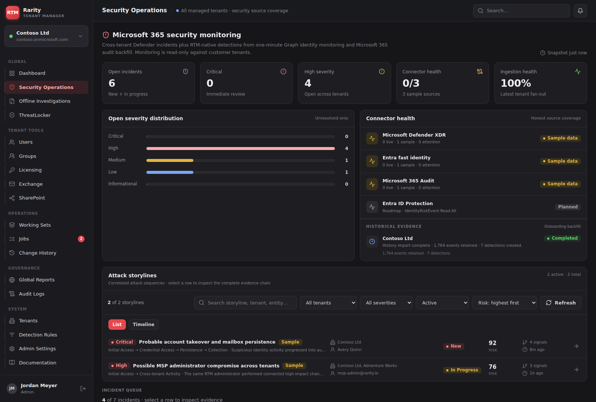
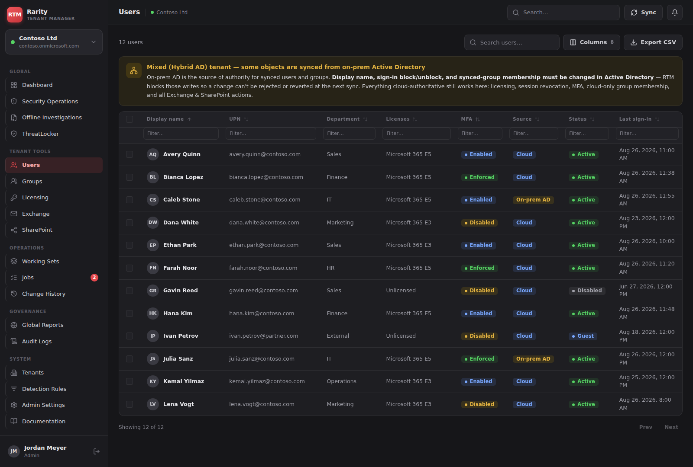
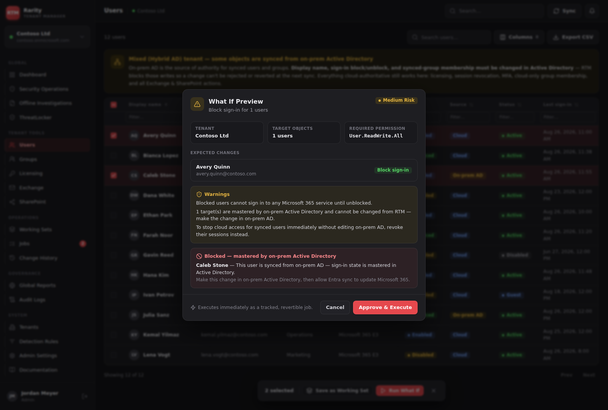
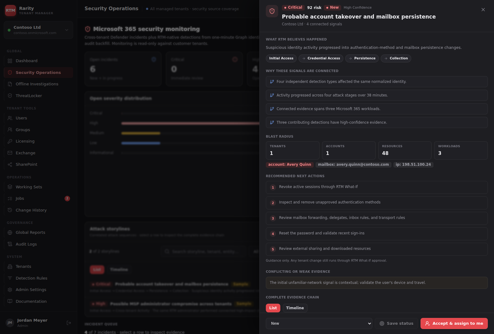
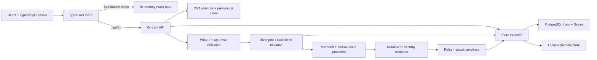

<div align="center">

# RTM · Rarity Tenant Manager

**Microsoft 365 operations, reviewed changes, and explainable security investigations in one MSP console.**


[Try it locally](#try-it-locally) · [Architecture](#architecture) · [Engineering details](#engineering-details) · [Setup guide](docs/USAGE.md)

</div>

RTM is a self-hosted application for teams managing multiple Microsoft 365 tenants.
It brings directory, licensing, Exchange, SharePoint, and security workflows into
a tenant-aware console. Operators preview supported changes before executing them,
track their outcomes, and inspect the evidence behind security detections.

**Beta:** the repository includes a React frontend, Go API, PostgreSQL store, and
River worker. A standalone frontend demo uses synthetic data, with no Microsoft
account or external services required. Live integrations have explicit limitations
described below.



*The implemented Security Operations console running locally in mock mode.
Every person, tenant, incident, and metric shown is sample data.*

## What you can explore

| Workspace | Implemented behavior |
|---|---|
| Tenant administration | Connect and remove tenants, inspect service connections, and run read-permission preflight. |
| Directory and Microsoft 365 | Search users and groups; inspect licensing, mailboxes, sites, and hybrid AD source-of-authority labels. |
| Reviewed changes | Generate a What-If preview, inspect permissions and blocked targets, then approve supported actions as tracked jobs. |
| Security Operations | Browse incidents, source coverage, normalized evidence, and correlated attack storylines with confidence and weak-evidence explanations. |
| Offline investigations | Analyze uploaded Microsoft audit JSON/CSV in separate case workspaces, without mixing evidence into live tenant incidents. |
| Governance | Inspect job outcomes, audit logs, change history, working sets, and read-only cross-tenant reports. |
| ThreatLocker | A separate MSP parent-organization workspace for supported device, policy, approval, and application workflows. |

<details>
<summary><strong>View the directory, change preview, and investigation screenshots</strong></summary>

### Directory with hybrid identity context



### What-If before a write



### Explainable attack storyline



All screenshots are actual browser captures of this repository's frontend using
the built-in mock dataset. See [capture provenance and reproduction steps](docs/screenshots/README.md).

</details>

## Try it locally

Prerequisites: **Node.js 24+** and npm. From the repository root:

```bash
git clone https://github.com/AaronCampbellit/RTM-Rarity-Tenant-Manager-public.git
cd RTM-Rarity-Tenant-Manager-public/frontend
npm ci
VITE_USE_MOCK=true npm run dev -- --host 127.0.0.1
```

Open **http://127.0.0.1:5173**. Mock mode signs you in as a sample administrator;
no password, tenant connection, or API server is needed. Its in-memory data resets
on reload. This mode demonstrates the UI and workflow shapes, not live provider
access or server-side authorization.

For a short walkthrough:

1. Open **Users** and search or filter the synthetic Contoso directory.
2. Select **Avery Quinn** and **Caleb Stone**, choose **Run What If → Block sign-in**,
   and generate the preview. The cloud user is eligible; the on-prem AD user is
   blocked because Active Directory owns that setting. Choose **Cancel** to exit.
3. Open **Security Operations**, then the **Probable account takeover and mailbox
   persistence** storyline to inspect connected evidence and response guidance.

For the authenticated Go API, PostgreSQL/worker setup, and provider configuration,
use the [setup guide](docs/USAGE.md).

## Architecture



The API and worker share the same models, provider contracts, and store interface.
Without a database, local development uses the memory store and inline execution.
PostgreSQL deployments use persistent state and a separate River worker. Microsoft
provider routing supports sample data and tenant-specific app credentials; the
ThreatLocker backend requires a configured parent connection.

## Engineering details

| Concern | Implementation |
|---|---|
| Operator sessions | Short-lived access JWTs, refresh rotation and reuse rejection, forced bootstrap password rotation, credential-version invalidation, and rate-limited login/refresh. |
| Change control | Previews computed from current state, approval validation, per-target outcomes, audit records, and revert snapshots where an action supports them. |
| Hybrid identities | Source-of-authority checks block directory changes mastered by on-prem AD before queuing them. |
| Provider boundaries | Tenant-specific Entra authorities and credentials; unsupported live operations return explicit errors. |
| Cross-tenant reporting | Bounded fan-out with per-tenant partial-failure handling; reporting surfaces remain read-only. |
| Security evidence | Independent ingestion checkpoints, provider-ID deduplication, normalized events, versioned detections, and explicit source coverage. |
| Investigations | Explainable storyline relationships and risk scores; offline cases reuse analysis while remaining separate from live evidence. |
| Frontend consistency | Shared tables, dialogs, design tokens, loading/error states, and a typed mock/real API boundary. |

**Access model:** the current v1 roles give authenticated RTM operators read
access to all managed tenants. Elevated permissions govern administration and
change execution. Tenant context and provider credentials are scoped by tenant;
this is not a per-technician tenant-assignment model.

## Checks

```bash
# Frontend: run from the repository root
cd frontend
npm ci
npm run build
npm test
```

```bash
# Backend: requires Go 1.26.8+; use a separate shell from the repository root
cd backend
make vet test build
```

The frontend suite covers queue sorting, evidence presentation, preflight,
session-query behavior, exports, navigation, user actions, and other workflow
helpers. Backend tests exercise authentication, stores, API workflows, reports,
and provider clients against fake services. Passing local tests does not verify
permissions or behavior in a live Microsoft tenant.

## Current limits

- Frontend mock mode bypasses authentication and simulates provider data; backend
  sample mode is separate and still uses real RTM authentication.
- Some Exchange, SharePoint administration, and ThreatLocker actions are unavailable
  on live providers. Microsoft API coverage, consent, and tenant configuration
  determine which workflows can execute; see [provider limitations](docs/USAGE.md#provider-configuration-and-limits).
- Entra ID Protection risk ingestion is planned. Security detections and response
  guidance require analyst review; monitoring does not automatically remediate tenants.
- Revert applies only to actions with supported snapshots; password reset, session
  revocation, and other irreversible operations cannot be undone by RTM.
- Shared rate limiting for multiple API instances, Dockerized PostgreSQL integration
  coverage, and sqlc query generation remain deferred. The pgx store currently uses
  hand-written queries.

## Repository map

- [`frontend/`](frontend/) — React, Vite, TypeScript, Tailwind, shared UI and feature workspaces.
- [`backend/`](backend/) — Go API, worker, providers, evidence analysis, stores, and migrations.
- [`docs/USAGE.md`](docs/USAGE.md) — development, deployment setup, provider prerequisites, and limitations.
- [Architecture specification](<RTM System Architecture.md>), [API specification](<RTM API Specification.md>),
  [security specification](<RTM Security Specification.md>), and [architecture decisions](<RTM Architecture Decision Records.md>).
- [Security Operations](<RTM Security Operations Module.md>), [attack storylines](<RTM Attack Storylines.md>),
  and [hybrid identity plan](<RTM Hybrid Implementation Plan.md>) — design and implementation references.

## Branding and ownership

The **Rarity** name and associated branding are owned by **Rarity LLC**. The original software is owned by **Aaron Campbell**. This repository grants no rights to Rarity LLC's name, logos, or branding. See [the ownership and branding notice](BRANDING.md).

## License

Aaron Campbell reserves all rights to the original material he owns; see [LICENSE](LICENSE). Third-party code, dependencies, and assets retain their own licenses and notices. See [third-party notices](THIRD_PARTY_NOTICES.md) for reviewed components and outstanding publication or distribution requirements.
