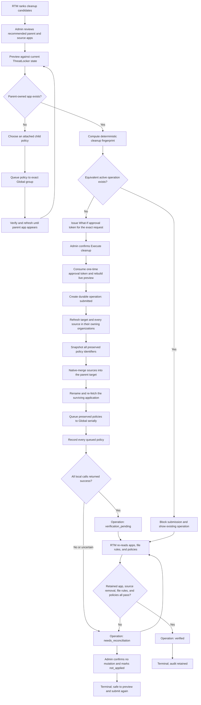

# RTM ThreatLocker Module

Status: **implemented** (backend `internal/threatlocker` + handlers/worker,
frontend `features/threatlocker`, tests; see the API Specification for the
endpoint contract). This is the v1 scope for RTM's
first non-Microsoft connector, proving the module/connector framework the
vision doc reserves architecturally. Everything here follows the established
RTM contract: one global write-only connection, What-If preview before every
write, jobs with per-target partial-failure tolerance, change history with
revert snapshots, and a separate audit trail.

## Purpose

Manage the MSP ThreatLocker workspace from RTM: see device protection state
across the parent and child organizations, put devices into and out of
maintenance modes, process application-control approval requests, and clean up
duplicate Application Control apps/policies into parent-owned global apps —
all gated by RTM's preview/audit model instead of raw portal clicks.

## Connection model

ThreatLocker's Portal API authenticates with an API token created under
Administrators → API Users in the ThreatLocker portal. MSP parent-org tokens
can act on child organizations via the `managedOrganizationId` request header.
RTM stores one global connection under **Admin Settings**:

- **Instance** — the portal region identifier (`g`, `h`, …); base URL is
  `https://portalapi.{instance}.threatlocker.com/portalapi/`.
- **API token** — the MSP parent API User token. Stored encrypted and
  write-only; never returned or logged.
- **Parent organization ID** — the MSP parent GUID. Global reads include child
  organizations; writes use the owning child organization when the portal
  resource identifies it.

Model changes:

- `TenantConnections` contains only Microsoft/SharePoint tenant services.
  ThreatLocker fields are rejected by tenant create/update endpoints.
- `RTM_THREATLOCKER_INSTANCE`, `RTM_THREATLOCKER_TOKEN`, and
  `RTM_THREATLOCKER_PARENT_ORG_ID` are optional deployment-time fallbacks.
  The parent organization ID is required for the Apps cleanup workflow because parent-owned apps,
  app-file insertion, and deploy queue calls run against the MSP parent org.
- Admins can configure the global MSP instance, token, and parent organization
  ID from **Admin Settings → App Settings**. RTM encrypts the token at rest,
  never returns it to the browser, and uses the database value immediately for
  API and worker calls. Environment values remain a deployment-time fallback
  only when no global GUI configuration is stored.
- Missing global instance/token/parent-org config returns `NOT_CONNECTED`.
  There is no sample-data fallback. A proposed Admin Settings connection is
  tested before it replaces the active connection; failed validation preserves
  the current settings.

## Provider

New package `internal/threatlocker`, shaped like `internal/graph`:

- `Provider` interface (reads + writes below), consumed by handlers and worker.
- `client.go` — live client: token auth header + `managedOrganizationId`,
  paginated POST list endpoints, httpx-style error mapping, no token in logs.
- Live-only — no sample implementation. Tests exercise the client against a
  fake ThreatLocker HTTP server, the same approach as the live Graph client
  tests.

## Entities

JSON shapes are the `/api/v1` contract, mirrored in `frontend/src/types`.

- **Device** — `id`, `hostname`, `group`, `os` (`windows|mac|linux`),
  `agentVersion`, `mode` (`secured | monitor_only | learning | installation |
  maintenance | lockdown | isolated`), `modeExpires` (RFC3339, empty = none),
  `tamperProtection` (bool), `lastCheckIn`, `online` (bool).
- **DeviceGroup** — `id`, `name`, `deviceCount`.
- **ApprovalRequest** — `id`, `deviceId`, `deviceName`, `requester`,
  `application`, `path`, `hash`, `requestType` (`execution | elevation |
  storage`), `status` (`pending | approved | denied`), `requestedAt`.
- **TLPolicy** — `id`, `name`, `action`, `policyActionId`, `appliesTo`,
  `status`, application/user counts, and editable detail fields for the
  supported policy update/promote paths.
- **TLApplication** — `id`, `name`, `description`, owning organization,
  `source` (`parent | tenant`), OS, status, built-in/hidden flags, policy
  count, file count, and update timestamp.
- **TLApplicationFile** — application file rule data (`fullPath`,
  `processPath`, `cert`, `hash`, `installedBy`, `keyFile`, hash-only flag,
  notes, OS).

## Read operations

The ThreatLocker tool is global parent-organization scoped, server-side auth
enforced, and does not change when the active RTM tenant changes. There are no
tenant-scoped ThreatLocker endpoints. Portal API mapping follows.

| Endpoint | Backing API |
|---|---|
| `GET /api/v1/threatlocker/devices` | `Computer/ComputerGetByAllParameters` (filter/sort/paginate) |
| `GET /api/v1/threatlocker/devices/{deviceId}` | `Computer/ComputerGetForEditById` + maintenance status |
| `GET /api/v1/threatlocker/device-groups` | `ComputerGroup` list |
| `GET /api/v1/threatlocker/approval-requests?status=pending` | `ApprovalRequest/ApprovalRequestGetByParameters` |
| `GET /api/v1/threatlocker/approval-requests/{id}` | `ApprovalRequest/ApprovalRequestGetPermitApplicationById` |
| `GET /api/v1/threatlocker/policies` | `Policy/PolicyGetByParameters` |
| `GET /api/v1/threatlocker/apps` | `Application/ApplicationGetByParameters` for parent org with child organizations included |
| `GET /api/v1/threatlocker/apps/{appId}` | `Application/ApplicationGetById` + `ApplicationFile/ApplicationFileGetByParameters` (POST; requires the app's `osType`) |

### Authenticated session preload

After authentication and required password rotation, RTM begins loading the
ThreatLocker workspace in the background. Apps and devices start first, with
at most two portal-heavy reads running concurrently; policies, approvals,
cleanup operations, and cleanup candidates follow. Results remain in browser
memory for the current login session only, refresh quietly every 60 seconds,
and are cleared on logout. The ThreatLocker route consumes the same in-flight
promises and values, so navigation does not start duplicate reads or blank
already-loaded rows.

The backend keeps the successful unfiltered application inventory for at most
60 seconds and shares it between the Apps and cleanup-candidate routes.
Concurrent callers join the same portal request. Failed portal reads are not
cached. `refresh=true` invalidates this snapshot; the Clean up refresh action
reloads Apps first and then recomputes candidates from that fresh inventory.
What-If, execution, verification, and every other write remain live and
uncached.

Reporting/dashboard is computed once for the global workspace:

- Global report: **ThreatLocker posture** — devices total /
  secured / in reduced-protection modes, pending approval requests, devices
  offline > 7 days, oldest agent version.
- Dashboard card: pending approval requests across granted tenants; devices
  currently in a reduced-protection mode (maintenance/monitor-only/learning).

## Write actions

Every write goes through the existing pipeline: `POST /changes/preview`
computes the What-If **from live device state** (current mode → target mode
per device, no-op detection, offline-device warning: "applies at next
check-in"), `POST /changes/execute` queues a River job (inline executor in
memory mode) that performs the ThreatLocker call **per device** with
partial-failure tolerance, completes with a real duration, appends the change
record (before/after, execution log, revert snapshot), and audits. Revert
replays the snapshot and marks the original Reverted.

Targets: device actions send `deviceIds[]`; approval actions send
`approvalRequestIds[]`.

### Device state (9 actions)

| Action | Params | ThreatLocker call | Revert |
|---|---|---|---|
| `enter_maintenance_mode` | `maintenanceType` (`monitor_only\|learning\|installation\|disable_protection`), `durationMinutes` (required, max 1440) | `Computer/ComputerDisableProtection` / `ComputerUpdateMaintenanceMode` | `secure_device` |
| `secure_device` | — | `Computer/ComputerEnableProtection` | NOT revertible (prior mode + expiry not snapshotted — same rationale as `clear_forwarding`) |
| `lockdown_device` | — | lockdown via maintenance-mode update | `release_lockdown` |
| `release_lockdown` | — | ″ | `lockdown_device` — preview WARNS: releasing clears the device's active alerts |
| `isolate_device` | — | network isolation via maintenance-mode update | `release_isolation` |
| `release_isolation` | — | ″ | `isolate_device` — same alert-clearing warning |
| `enable_tamper_protection` | — | `ComputerUpdateMaintenanceMode` (tamper) | `disable_tamper_protection` |
| `disable_tamper_protection` | — | ″ | `enable_tamper_protection` — preview WARNS: protection reduced |
| `restart_agent` | — | `Computer/ComputerUpdateShouldRestartByIds` | NOT revertible (nothing to restore — like `revoke_sessions`) |

`enter_maintenance_mode` previews WARN that protection is reduced, with the
`disable_protection` type flagged as the highest-risk state.

### Approval requests (2 actions)

| Action | Params | ThreatLocker call | Revert |
|---|---|---|---|
| `approve_request` | `scope` (`computer\|group\|organization`), optional `expiresAt` (temporary permit) | `ApprovalRequest/ApprovalRequestPermitApplication` (+ `Application/ApplicationGetMatchingList` to build the permit) | NOT revertible in v1 — approving creates a ThreatLocker policy; the created policy id is captured in the change record so a future policy-management phase can disable it. Preview WARNS. |
| `deny_request` | optional `reason` | approval-request deny endpoint | NOT revertible (requester must resubmit). |

Approval previews show the application, full path, hash, requester, device,
and exactly what the resulting permit will cover (scope + expiry) — approving
an execution request is a policy write and is presented as such.

### Application cleanup (admin-only)

The Clean up tab is a guided operational surface for similar applications
across managed organizations:

| Endpoint | Purpose | ThreatLocker calls |
|---|---|---|
| `PATCH /api/v1/threatlocker/apps/{appId}` | Rename/update an application visible to the parent org | `Application/ApplicationGetById` + `Application/ApplicationUpdateById` |
| `GET /api/v1/threatlocker/apps/cleanup-candidates` | Rank cross-organization application families and recommend a parent-owned canonical app | Shared application inventory (`refresh=true` forces `Application/ApplicationGetByParameters`) |
| `POST /api/v1/threatlocker/apps/cleanup-preview` | Preview native merge, exact Global destination, preserved policies, and any required parent promotion | app list/detail in owning orgs, app files, `Policy/PolicyGetForViewPoliciesByApplicationId`, `ComputerGroupGetDropdownWithOrganization` |
| `POST /api/v1/threatlocker/apps/cleanup-parent-promote` | Promote one attached child policy to Global so ThreatLocker creates the parent-owned merge target | `PolicyGetForPromotePolicyById`, `ShouldPromoteApplication`, `PolicyMoveQueueInsert` |
| `POST /api/v1/threatlocker/apps/cleanup-execute` | Native-merge child apps into the verified parent target, retain the final name, then queue preserved policies to Global serially | `ApplicationGetById` in each owning org, `ApplicationUpdateForMerge`, `ApplicationUpdateById`, `PolicyGetForPromotePolicyById`, `ShouldPromoteApplication`, `PolicyMoveQueueInsert` |
| `GET /api/v1/threatlocker/apps/cleanup-operations` | List the durable cleanup ledger for the current scope | None |
| `POST /api/v1/threatlocker/apps/cleanup-operations/{operationId}/verify` | Prove the promoted parent target or the retained app, merged-source removal, file rules, and every preserved Global policy | application list/files, policy detail/list |
| `POST /api/v1/threatlocker/apps/cleanup-operations/{operationId}/reconcile` | Record portal verification as `verified` or `not_applied` | None |

Execution is intentionally fail-closed. A child-owned app is never accepted as
the merge target. When no parent app exists, the operator first approves one
attached child policy for Global promotion; ThreatLocker creates the parent app
as part of that queue lifecycle. After refresh discovers it, RTM snapshots
every non-pushed policy, native-merges the source apps, verifies the retained
name, and queues preserved policies to the exact `Global` group one at a time.
RTM never falls back to an arbitrary parent group.

Two portal semantics discovered against the live API shape this flow:

- **Applications and policies are org-addressed.** Application details, file
  rules, and attached policies are read in the application's owning
  organization. `PolicyGetForViewPoliciesByApplicationId`
  returns policies from child organizations too, but `PolicyGetById`,
  `PolicyUpdateById`, and `PolicyUpdateForDeleteByIds` only answer when the
  `managedOrganizationId` header names the policy's *owning* organization
  (otherwise: "Unable to retrieve application policy"). The cleanup preview
  therefore carries each preserved policy's owning `organizationId`.
  `ShouldPromoteApplication` runs in the surviving application's organization,
  while `PolicyMoveQueueInsert` runs in the policy's original organization.
  `GET
  /api/v1/threatlocker/policies/{policyId}?orgId=<owning org>` addresses a
  child-org policy directly.
- **Parent-pushed copies are not deletable.** A policy the parent org applies
  into a child org materializes there as a portal-managed row named
  `PARENT ORG\Policy name`; deleting it returns "You are not authorized to
  delete policy", and it follows its defining parent policy automatically.
  Cleanup excludes these rows from direct promotion and surfaces a preview
  warning instead.

#### Cleanup lifecycle

RTM records a cleanup operation before its first ThreatLocker mutation. A
deterministic fingerprint covers the selected applications, retained
application and policy, canonical name, and deletion mode. An equivalent
operation in `submitted`, `verification_pending`, or `needs_reconciliation`
blocks another submission until an administrator checks the ThreatLocker
portal and reconciles the ledger.



`verification_pending` means RTM received successful mutation responses but
has not yet proved convergence. Parent-promotion verification checks for the
new parent app without turning ordinary queue latency into a failure. Merge
verification independently confirms the retained parent app, expected file
rules, source removal, and every preserved Global policy binding.
`needs_reconciliation` is deliberately
fail-closed because a timeout, mismatch, or later-step failure may follow an
already applied external write. Choosing `not_applied` releases the fingerprint
only after an administrator has confirmed that no ThreatLocker mutation
occurred.

### Revert mapping (worker constants)

```
enter_maintenance_mode  ↔ secure_device        (one-way pair, like set/clear_forwarding)
lockdown_device         ↔ release_lockdown
isolate_device          ↔ release_isolation
enable_tamper_protection ↔ disable_tamper_protection
secure_device, restart_agent, approve_request, deny_request → not revertible
```

Job type labels: `Maintenance Mode Change`, `Device Protection Change`,
`Device Lockdown Change`, `Device Isolation Change`, `Tamper Protection
Change`, `Agent Restart`, `Approval Decision`.

### Explicitly out of scope / future depth

- Full policy authoring UX and a policy-specific revert flow for
  `approve_request` remain future work. RTM currently supports the policy
  fields needed for edit, promote-global, template deploy, and app cleanup.
- Agent version pinning (`ComputerUpdateThreatlockerVersionByIds` is
  deprecated for agents ≥ 10.7.3), baseline rescans, installer downloads /
  deployment, moving computers between organizations, deleting computers.
- Storage Control / Elevation / Network Control configuration (their approval
  requests still surface in the approval list).

## Security

- Tokens write-only, never in responses or app logs; audit trail records
  actions, not secrets.
- Tenant-scoped handlers authorize tenant access server-side; denials audited.
- All eleven actions require write permission on the tenant and are What-If
  gated; every preview/execute/revert is audited. There is **no separate
  approval workflow** for this module — a technician with RTM access to the
  tenant has approval rights.
- Reduced-protection actions (`enter_maintenance_mode`,
  `disable_tamper_protection`) and lockdown/isolation releases carry explicit
  preview warnings; global reporting stays read-only.

## Frontend

New feature folder `frontend/src/features/threatlocker`, built from the shared
`DataTable` + `components/ui` primitives and design tokens (no hardcoded
colors). Mock API in `src/api/client.ts` keeps shapes identical to the Go API.

- **ThreatLocker screen** (global parent-org tool, stable across tenant
  switches):
  - **Devices tab** — DataTable (hostname, group, OS, mode badge, tamper,
    agent version, last check-in), row selection → What-If action dialog for
    the nine device actions; device detail modal (state, mode expiry, recent
    RTM changes against it).
  - **Approval Requests tab** — pending requests table, row → detail modal
    (app/path/hash/requester) with Approve (scope + expiry picker) / Deny,
    both through the What-If dialog.
  - **Apps tab** — parent + tenant application inventory, search/export,
    rename, multi-select cleanup preview, merge into a parent app, policy
    promote/create, duplicate policy/app deletion.
  - **Policies tab** — list/edit/promote/template-deploy supported fields.
  - **Clean up tab** — ranked candidate families, explained match scores,
    guided parent-app and policy What-If review, durable execution ledger, and
    automatic five-check portal verification.
- Admin Settings owns the only ThreatLocker connection. Tenant create, detail,
  and edit screens contain no ThreatLocker controls or connection status.
- Global reports screen gains the ThreatLocker posture report.

## Rollout

The module ships as **one delivery**: model types, the `internal/threatlocker`
provider, creds storage + connect/test UI, all six read endpoints, the
ThreatLocker screen, the posture report, and all eleven write actions
end-to-end (preview / execute / revert / audit / worker) with tests — against
ADR-019's Definition of Done: backend + frontend + API docs + permission
checks + audit logging + tests + What-If on writes + revert where applicable.

Policy management (which unlocks making `approve_request` revertible),
storage/elevation config, and agent deployment remain future work.


## Live API scope (verified against the ThreatLocker portal Swagger)

The public ThreatLocker portal API (`portalapi.{instance}.threatlocker.com`)
determines what works against real tenants:

- **Reads**: devices (`Computer/ComputerGetByAllParameters`), device detail
  (resolved from the list), device groups (aggregated from the device list —
  there is no count-bearing group endpoint), approval requests
  (`ApprovalRequest/ApprovalRequestGetByParameters`) + detail
  (`ApprovalRequestGetById`), policies (`Policy/PolicyGetByParameters`), and
  apps/app files (`ApplicationGetByParameters`, `ApplicationGetById`,
  `ApplicationFile/ApplicationFileGetByParameters`). App file rules come from
  `ApplicationFileGetByParameters` (POST) — it requires the owning app's
  `osType` (a missing value returns 417 "Invalid Operating System Type"); the
  older `ApplicationFileGetByApplicationId` GET endpoint 500s on live instances.
  App-list rows carry no file-rule count and report policies per scope, so the
  Apps list sums `computerPolicyCounts + groupPolicyCounts +
  organizationPolicyCounts` for its Policies column and shows file counts only
  in the app detail. The policy list endpoint is absent
  from the trimmed public Swagger but documented in the KB and live on real
  instances.
- **Writes (live)**: `enter_maintenance_mode` (Monitor Only / Learning via
  `ComputerDisableProtection`), `secure_device` (`ComputerEnableProtection`),
  `restart_agent` (`ComputerUpdateShouldRestartByIds`), `approve_request`
  (`ApprovalRequestGetPermitApplicationById` → `ApprovalRequestPermitApplication`),
  `deny_request` (`ApprovalRequestUpdateForReject`), app rename/update,
  application insert/delete, app-file insert, policy update/insert/delete, and
  deploy policy queue as used by Apps cleanup.
- **Not exposed by the public API**: lockdown, isolation, and tamper-protection
  toggles. RTM keeps the actions defined but fails them honestly with
  NOT_IMPLEMENTED rather than guessing a payload against real devices.

Device fields are mapped from the verified portal response (`mode` +
containment booleans `isIsolated`/`isLockDownMode`/`isTamperProtectionDisabled`,
`group`, `serviceVersion`); online is derived from `lastCheckin` recency.
